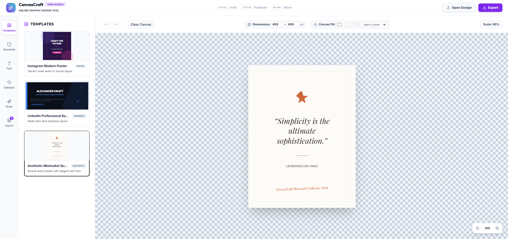

# CanvasCraft

**CanvasCraft** is an open-source, web-based graphic design editor built on SvelteKit and Tailwind CSS v4. It serves as a modern, lightweight Canva alternative that runs entirely in the browser, offering rich interactive features for graphic creation, template editing, and multi-layer layouts.



## Key Features

- **Interactive Canvas Stage**: Drag, resize, and rotate elements freely with projections, bounding boxes, and rotation controls.
- **Dynamic Previews & Preset Templates**: Loaded with pre-designed layouts (Instagram Poster, LinkedIn Banner, Minimalist Quote) that render real-time previews directly in the sidebar drawer.
- **Layers Panel**: Drag-to-reorder, rename, toggle visibility (hide/show), and lock individual elements to prevent accidental modifications.
- **Rich Elements & Drawing Mode**:
  - Add text with customizable typography (Inter, Montserrat, Playfair Display, Outfit, Caveat), sizes, colors, and alignments.
  - Draw elements (Rectangle, Circle, Triangle, Star, Pentagon, Hexagon).
  - Freehand paintbrush sketch mode with adjustable stroke width and color.
  - Upload local images or drop them directly onto the canvas.
- **Drag-and-Drop Dropzone**: Drag shapes, typography, and uploaded images directly from the sidebar onto the canvas sheet.
- **Alignment Guidelines**: Interactive snapping guidelines that help align items exactly to the center or boundaries of the canvas.
- **Undo/Redo History**: Deep-cloned, 50-step history tracking to undo/redo operations with ease.
- **Exporting Options**: Download your final design instantly as PNG, JPEG, SVG, or save the project as an editable `.json` file to import later.

## Tech Stack

- **Framework**: [SvelteKit](https://kit.svelte.dev/) (Svelte 5)
- **Styling**: [Tailwind CSS v4](https://tailwindcss.com/)
- **Icons**: [Lucide Svelte](https://lucide.dev/)
- **Export Utility**: `html-to-image`
- **Effects**: `canvas-confetti`

## Getting Started

### Prerequisites

Ensure you have [Node.js](https://nodejs.org/) installed.

### Installation

1. Navigate to the project directory:
   ```bash
   cd canvas-craft
   ```

2. Install dependencies:
   ```bash
   npm install
   ```

### Development

Start the Vite development server locally:
```bash
npm run dev
```
Open `http://localhost:5173/` in your browser.

### Building

Build the production bundle:
```bash
npm run build
```
Verify the production build locally:
```bash
npm run preview
```

## License

This project is open-source and available under the [MIT License](LICENSE).
